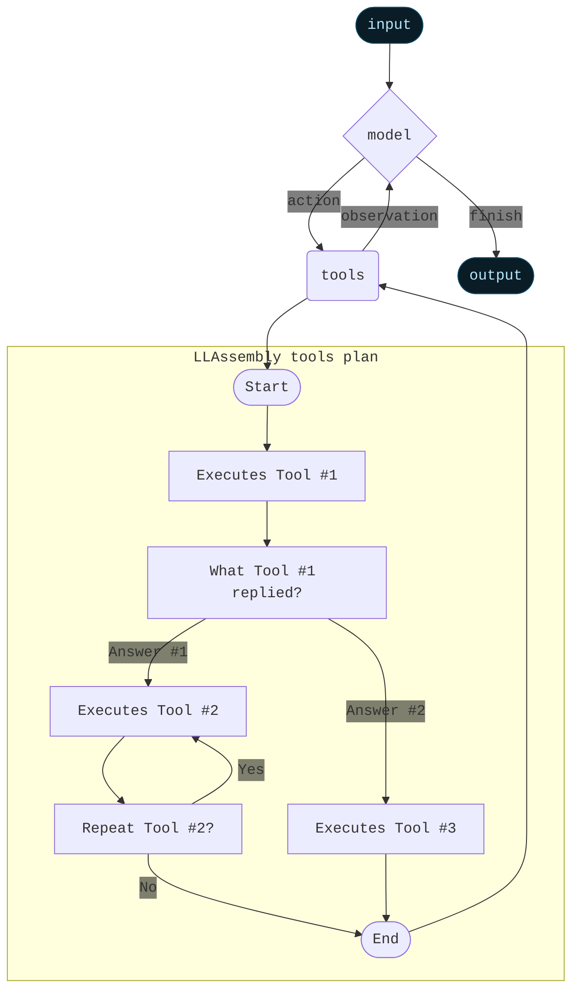

## About

LLAssembly is a tool-orchestration library for LLM agents.

Rather than having the LLM invoke tools repeatedly in a fixed sequence, LLAssembly asks the model to write complete execution plan up-front that includes conditionals, loops, and state tracking in assembly-like program that then initiates tools during emulation process, enabling complex control flow within a single agent invocation.

Below is an updated version of the diagram from the [official LangChain documentation](https://docs.langchain.com/oss/python/langchain/agents), extended with the LLAssembly execution plan:
<details>
<summary>Diagram (click to expand)</summary>
	

</details>

Currently following libs/frameworks supported:
- LangChain
- LangGraph
- PydanticAI - WIP
- [Any other Agent tool](https://github.com/electronick1/LLAssembly?tab=readme-ov-file#calling-asm-emulator-directly-from-any-agent-tool)

Anthropic and PydanticAI focusing on generating Python code to orchestrate tool calls. However, running arbitrary Python code generated by LLMs for orchestration could be unsafe ([as in Anthropic’s approach](https://platform.claude.com/docs/en/agents-and-tools/tool-use/programmatic-tool-calling)), and emulating Python in Rust to solve that ([as Pydantic does](https://pydantic.dev/articles/pydantic-monty)) is complex. LLAssembly offers a simpler solution to the tool call orchestration problem. Assembly getting things done orchestrating tool calls and it's not hard to emulate it in a strict and controlled environment on python.

⚠️ Work in progress! LLAssembly is under active development, some parts not tested well and could be unstable. Feedback and PRs are welcome. If you hit issues, please open a ticket.

## Use Cases

LLAssembly was originally designed for in-game NPC unit control throught natural language commands. A command like:
`Go to 5,5 if you see enemy on the road attack him and run to 7,7` is a sequence of actions with conditions ("if you see enemy ...") and repeated checks (“look for an enemy at each step”). A traditional “get next tool to call” approach often needs an LLM round trips at each step to decide what to do next, which can quickly balloon into hundreds of requests per unit and introduce latency. With LLAssembly, you make only one request that generates a complete execution plan to react on environment change, implement conditions, loops and track state between tool calls.

This approach is particularly useful in scenarios where you need to reduce the number of requests to LLMs, and when context/environment between tool calls changes rapidly. For instance:

- **Robotics**: When decisions depend on sensor input and must happen quickly, minimizing LLM round trips is crucial.
- **Code Assistants**: When execution requires complex control-flow and number of LLM requests is what you are paying for
- **Game AI**: When you want to control NPC depending on the rapidly changing environment and there is no time to wait for a next action from LLM
- **Automated Workflows**: When you need to orchestrate multiple tools with a branching logic


## Why Assembly?

When you want tool orchestration with branching logic or loops, there are a few common approaches, each with tradeoffs:
- The traditional approach when you ask LLM for a next tool to run on every step results in many LLM requests and additional delays to get reply from LLM.
- Creating your own DSL (doman specific language) that will describe the logic for the tool calls - often leads to LLM hallucination, as it tends to make things up due to the luck of context (training set) about this custom DSL.
- Asking the model for a high-level language code (e.g. Python, JS, Lua, ...) for execution plan to invoke tool calls may offer greater stability, since LLMs are better at generating python code than Assembly, for example like Claude ["Programmatic tool calling"](https://platform.claude.com/docs/en/agents-and-tools/tool-use/programmatic-tool-calling) does. However running LLM generated code without verification may introduce notable risks raising safety and sandboxing concerns that are difficult to fully mitigate, even within containers. Emulating a full high-level language runtime is also complex. In contrast, a simplified, assembly-like code can be emulated in a few hundred lines of Python code in a very strict and tightly controlled environment.

The Assembly (also SQL) instructions set is a middle ground between custom DSL and high-level programming code - it can be emulated in a strict environment (in fact it's converted to a LangGraph sub-graph) and most LLMs have more than enough context about Assembly to handle tool calls, for example `gpt-oss:20b` that fits in 16G GPU getting things done in handling NPC unit commands.

## How It Works

Currently LLAssembly supports LangChain and LangGraph. When you invoke the agent:
1. Your request is wrapped in a system prompt that instructs the LLM to generate assembly-like instructions rather than directly calling tools.
2. The LLM returns a sequence of Assembly instructions describing the intended behavior and control flow.
3. The assembly code is parsed and executed through a lightweight emulator, converting each Assembly instruction to the LangGraph nodes
4. During execution, the emulator performs the actual tool calls, stores intermediate results, and evaluates branches/loops based on tool outputs and tracked state.
5. The results are returned to the user, including all the intermediate tool responses

## Installation

`pip install llassembly`

## Get started

#### Using LangChain
For LangChain simple add `ToolsPlannerMiddleware()` to the middlewares, it will modify the system prompt to produce assembly instructions and start emulation proces that will invoke tools provided to the agent.
For LangGraph add `ToolsPlannerNode(ollama_model, tools=[...])` to your graph for sync requests and `AToolsPlannerNode(...)` for async, this node will build sub-graph with assembly instructions invoking tools during sub-graph execution.

```python
import random
from langchain.agents import create_agent
from langchain.tools import tool
from langchain_ollama import ChatOllama
from langchain.messages import HumanMessage

from llassembly.langchain import ToolsPlannerMiddleware


@tool
def get_weather(city: str) -> int:
    """
    Returns weather in celsius for a city.
    """
    if city.lower() == "paris":
        return -10
    return random.randint(0, 20)


if __name__ == "__main__":
    ollama_model = ChatOllama(
        base_url="",            # URL to ollama model
        model="gpt-oss:20b",    
    )
    agent = create_agent(
        model=ollama_model,     # Ollama or any other model
        tools=[get_weather],
        middleware=[ToolsPlannerMiddleware()],
    )
    # Ask LLM to check weather by conditional stmt and multiple
    # cities, in one request to LLM agent.
    result = agent.invoke(
        {"messages": [HumanMessage("""
    Check weather in Paris and if lower than 0 
    check weather in 10 other European cities
        """)]},
    )
    print(result["messages"])
```

#### Calling Asm emulator directly from any agent tool

You can initiate ASM emulator from any agent by replacing system message manually and
providing the list of tools you want to call as python Callables.

Here ollama example:

```python
import ollama
from llassembly import ASMEmulator, ExternCall
from llassembly import get_asm_prompt

ollama_client = ollama.Client(host="")


def do_sum(a: int, b: int) -> int:
    """
    Returns sum of a+b
    """
    return a + b


def llm_request():
    # Your tools as assembly "extern calls" 
    extern_calls = [ExternCall.from_callable(do_sum)]

    resp = ollama_client.chat(
        messages=[
            # Add system prompt that generates assembly
            {"role": "system", "content": get_asm_prompt("Your system prompt", extern_calls)},
            {"role": "user", "content": "Do 5+5"},
        ],
        model="gpt-oss:20b",
        stream=False,
        think=False,
    )

    # Init asm emulator with tools you want to call
    emulator = ASMEmulator.from_asm_code(resp.message.content)
    emulator.add_extern_calls(extern_calls)

    # Iterate tool calls during emulation
    for tool_ctx in emulator.iter_tool_calls():
        print(tool_ctx.call_tool_handler())  # Prints 10


llm_request()

```

## Examples

Here one of the example from `tests/use_cases` demonstrating complex tool handling with control-flow for in-game NPC unit:

Langchain example:
```python
from langchain.agents import create_agent
from llassembly import ToolsPlannerMiddleware

agent = create_agent(
    model=ollama_model,
    tools=[
        make_one_step,
        get_current_position,
        pick_sword,
        attack_enemy,
        has_sword,
        get_enemies_around
    ],
    middleware=[ToolsPlannerMiddleware()],
)

result = agent.invoke({
    "messages": [
        SystemMessage("Control in-game NPC unit based on the provided commands."),
        HumanMessage("Go to 5,5 if you see enemy on the road attack him and run to 7,7"),
    ]
})
```

LangGraph example:
```python
from llassembly import ToolsPlannerNode

agent_graph = StateGraph(MessagesState)
agent_graph.add_node("llm_tools_planner", ToolsPlannerNode(ollama_model, tools=[...]))
agent_graph.add_edge(START, "llm_tools_planner")
agent_graph.add_edge("llm_tools_planner", END)
agent = agent_graph.compile()
result = agent.invoke({
    "messages": [
        SystemMessage("Control in-game NPC unit based on the provided commands."),
        HumanMessage("Go to 5,5 if you see enemy on the road attack him and run to 7,7"),
    ]
})
```

This will result in assembly code like this (generated by gpt-oss:20b): 
```assembly 
; Target coordinates for first phase
MOV R1, 5         ; R1 = target_x
MOV R2, 5         ; R2 = target_y
loop_to_5_5:
    CALL get_current_position   ; Get current position (x,y)
    POP  R3                     ; R3 = current_x
    POP  R4                     ; R4 = current_y

    CMP  R3, R1                 ; Is current_x == target_x ?
    JNE  not_at_5_5             ; If not, still moving
    CMP  R4, R2                 ; Is current_y == target_y ?
    JNE  not_at_5_5             ; If not, still moving
    JMP  after_5_5              ; Destination reached

not_at_5_5:
    CALL get_enemies_around     ; Check for enemy around
    POP  R5                     ; R5 = enemy_id (0 if none)
    CMP  R5, 0                  ; Any enemy found?
    JNE  enemy_found
    JMP  step_5_5                ; No enemy, just step

enemy_found:
    CALL has_sword              ; Does unit already have a sword?
    POP  R6                     ; R6 = has_sword flag (1 or 0)
    CMP  R6, 0                  ; No sword?
    JNE  have_sword
    CALL pick_sword             ; Pick a sword
have_sword:
    PUSH R5                     ; Push enemy_id for attack
    CALL attack_enemy          ; Attack the enemy
    JMP  step_5_5                ; Continue moving after attack

step_5_5:
    PUSH R1                     ; Push target_x
    PUSH R2                     ; Push target_y
    CALL make_one_step          ; Take one step towards (5,5)
    JMP  loop_to_5_5            ; Repeat loop

after_5_5:
    ; Set new target coordinates for second phase
    MOV R1, 7                   ; R1 = target_x (7)
    MOV R2, 7                   ; R2 = target_y (7)
    JMP  loop_to_7_7

loop_to_7_7:
    CALL get_current_position   ; Get current position (x,y)
    POP  R3                     ; R3 = current_x
    POP  R4                     ; R4 = current_y

    CMP  R3, R1                 ; Is current_x == target_x ?
    JNE  not_at_7_7             ; If not, still moving
    CMP  R4, R2                 ; Is current_y == target_y ?
    JNE  not_at_7_7             ; If not, still moving
    JMP  end_program            ; Destination reached

not_at_7_7:
    PUSH R1                     ; Push target_x
    PUSH R2                     ; Push target_y
    CALL make_one_step          ; Take one step towards (7,7)
    JMP  loop_to_7_7            ; Repeat loop

end_program:
    RET                         ; Return from program
```

Which then will be converted to the LangGraph sub-graph where each ASM instruction is
a separate node. Such sub-graph will be executed with a provided context/state
and each "CALL" instruction will result in a tool call produce `ToolMessage`.

LangGraph with `get_graph().draw_mermaid()`:

```mermaid
---
config:
  flowchart:
    curve: linear
---
graph TD;
	__start__([<p>__start__</p>]):::first
	tools_planner_inst_\231(MOV R1, 5)
	tools_planner_inst_\232(MOV R2, 5)
	tools_planner_inst_\233(loop_to_5_5)
	tools_planner_inst_\234(CALL get_current_position)
	get_current_position_inst_\234(get_current_position tool instruction_#4)
	tools_planner_inst_\235(POP R3)
	tools_planner_inst_\236(POP R4)
	tools_planner_inst_\237(CMP R3, R1)
	tools_planner_inst_\238(JNE not_at_5_5)
	tools_planner_inst_\239(CMP R4, R2)
	tools_planner_inst_\2310(JNE not_at_5_5)
	tools_planner_inst_\2311(JMP after_5_5)
	tools_planner_inst_\2312(not_at_5_5)
	tools_planner_inst_\2313(CALL get_enemies_around)
	get_enemies_around_inst_\2313(get_enemies_around tool instruction_#13)
	tools_planner_inst_\2314(POP R5)
	tools_planner_inst_\2315(CMP R5, 0)
	tools_planner_inst_\2316(JNE enemy_found)
	tools_planner_inst_\2317(JMP step_5_5)
	tools_planner_inst_\2318(enemy_found:)
	tools_planner_inst_\2319(CALL has_sword)
	has_sword_inst_\2319(has_sword tool instruction_#19)
	tools_planner_inst_\2320(POP R6)
	tools_planner_inst_\2321(CMP R6, 0)
	tools_planner_inst_\2322(JNE have_sword)
	tools_planner_inst_\2323(CALL pick sword)
	pick_sword_inst_\2323(pick_sword tool instruction_#23)
	tools_planner_inst_\2324(have_sword:)
	tools_planner_inst_\2325(PUSH R5)
	tools_planner_inst_\2326(CALL attack_enemy)
	attack_enemy_inst_\2326(attack_enemy tool instruction_#26)
	tools_planner_inst_\2327(JMP step_5_5)
	tools_planner_inst_\2328(step_5_5:)
	tools_planner_inst_\2329(PUSH R1)
	tools_planner_inst_\2330(PUSH R2)
	tools_planner_inst_\2331(CALL make_one_step)
	make_one_step_inst_\2331(make_one_step tool instruction_#31)
	tools_planner_inst_\2332(JMP loop_to_5_5)
	tools_planner_inst_\2333(after_5_5:)
	tools_planner_inst_\2334(MOV R1, 7)
	tools_planner_inst_\2335(MOV R2, 7)
	tools_planner_inst_\2336(JMP loop_to_7_7)
	tools_planner_inst_\2337(loop_to_7_7:)
	tools_planner_inst_\2338(CALL get_current_position)
	get_current_position_inst_\2338(get_current_position tool instruction_#38)
	tools_planner_inst_\2339(POP R3)
	tools_planner_inst_\2340(POP R4)
	tools_planner_inst_\2341(CMP R3, R1)
	tools_planner_inst_\2342(JNE not_at_7_7)
	tools_planner_inst_\2343(CMP R4, R2)
	tools_planner_inst_\2344(JNE not_at_7_7)
	tools_planner_inst_\2345(JMP end_program)
	tools_planner_inst_\2346(not_at_7_7)
	tools_planner_inst_\2347(PUSH R1)
	tools_planner_inst_\2348(PUSH R2)
	tools_planner_inst_\2349(CALL make_one_step)
	make_one_step_inst_\2349(make_one_step_inst_#49)
	tools_planner_inst_\2350(JMP loop_to_7_7)
	tools_planner_inst_\2351(end_program:)
	tools_planner_inst_\2352(RET)
	__end__([<p>__end__</p>]):::last
	__start__ --> tools_planner_inst_\230;
	attack_enemy_inst_\2326 --> tools_planner_inst_\2327;
	get_current_position_inst_\2338 --> tools_planner_inst_\2339;
	get_current_position_inst_\234 --> tools_planner_inst_\235;
	get_enemies_around_inst_\2313 --> tools_planner_inst_\2314;
	has_sword_inst_\2319 --> tools_planner_inst_\2320;
	make_one_step_inst_\2331 --> tools_planner_inst_\2332;
	make_one_step_inst_\2349 --> tools_planner_inst_\2350;
	pick_sword_inst_\2323 --> tools_planner_inst_\2324;
	tools_planner_inst_\230 --> tools_planner_inst_\231;
	tools_planner_inst_\231 --> tools_planner_inst_\232;
	tools_planner_inst_\2310 -. &nbsp;False&nbsp; .-> tools_planner_inst_\2311;
	tools_planner_inst_\2310 -. &nbsp;True&nbsp; .-> tools_planner_inst_\2312;
	tools_planner_inst_\2311 -. &nbsp;False&nbsp; .-> tools_planner_inst_\2312;
	tools_planner_inst_\2311 -. &nbsp;True&nbsp; .-> tools_planner_inst_\2333;
	tools_planner_inst_\2312 --> tools_planner_inst_\2313;
	tools_planner_inst_\2313 --> get_enemies_around_inst_\2313;
	tools_planner_inst_\2314 --> tools_planner_inst_\2315;
	tools_planner_inst_\2315 --> tools_planner_inst_\2316;
	tools_planner_inst_\2316 -. &nbsp;False&nbsp; .-> tools_planner_inst_\2317;
	tools_planner_inst_\2316 -. &nbsp;True&nbsp; .-> tools_planner_inst_\2318;
	tools_planner_inst_\2317 -. &nbsp;False&nbsp; .-> tools_planner_inst_\2318;
	tools_planner_inst_\2317 -. &nbsp;True&nbsp; .-> tools_planner_inst_\2328;
	tools_planner_inst_\2318 --> tools_planner_inst_\2319;
	tools_planner_inst_\2319 --> has_sword_inst_\2319;
	tools_planner_inst_\232 --> tools_planner_inst_\233;
	tools_planner_inst_\2320 --> tools_planner_inst_\2321;
	tools_planner_inst_\2321 --> tools_planner_inst_\2322;
	tools_planner_inst_\2322 -. &nbsp;False&nbsp; .-> tools_planner_inst_\2323;
	tools_planner_inst_\2322 -. &nbsp;True&nbsp; .-> tools_planner_inst_\2324;
	tools_planner_inst_\2323 --> pick_sword_inst_\2323;
	tools_planner_inst_\2324 --> tools_planner_inst_\2325;
	tools_planner_inst_\2325 --> tools_planner_inst_\2326;
	tools_planner_inst_\2326 --> attack_enemy_inst_\2326;
	tools_planner_inst_\2327 -. &nbsp;False&nbsp; .-> tools_planner_inst_\2328;
	tools_planner_inst_\2328 --> tools_planner_inst_\2329;
	tools_planner_inst_\2329 --> tools_planner_inst_\2330;
	tools_planner_inst_\233 --> tools_planner_inst_\234;
	tools_planner_inst_\2330 --> tools_planner_inst_\2331;
	tools_planner_inst_\2331 --> make_one_step_inst_\2331;
	tools_planner_inst_\2332 -. &nbsp;True&nbsp; .-> tools_planner_inst_\233;
	tools_planner_inst_\2332 -. &nbsp;False&nbsp; .-> tools_planner_inst_\2333;
	tools_planner_inst_\2333 --> tools_planner_inst_\2334;
	tools_planner_inst_\2334 --> tools_planner_inst_\2335;
	tools_planner_inst_\2335 --> tools_planner_inst_\2336;
	tools_planner_inst_\2336 -. &nbsp;False&nbsp; .-> tools_planner_inst_\2337;
	tools_planner_inst_\2337 --> tools_planner_inst_\2338;
	tools_planner_inst_\2338 --> get_current_position_inst_\2338;
	tools_planner_inst_\2339 --> tools_planner_inst_\2340;
	tools_planner_inst_\234 --> get_current_position_inst_\234;
	tools_planner_inst_\2340 --> tools_planner_inst_\2341;
	tools_planner_inst_\2341 --> tools_planner_inst_\2342;
	tools_planner_inst_\2342 -. &nbsp;False&nbsp; .-> tools_planner_inst_\2343;
	tools_planner_inst_\2342 -. &nbsp;True&nbsp; .-> tools_planner_inst_\2346;
	tools_planner_inst_\2343 --> tools_planner_inst_\2344;
	tools_planner_inst_\2344 -. &nbsp;False&nbsp; .-> tools_planner_inst_\2345;
	tools_planner_inst_\2344 -. &nbsp;True&nbsp; .-> tools_planner_inst_\2346;
	tools_planner_inst_\2345 -. &nbsp;False&nbsp; .-> tools_planner_inst_\2346;
	tools_planner_inst_\2345 -. &nbsp;True&nbsp; .-> tools_planner_inst_\2351;
	tools_planner_inst_\2346 --> tools_planner_inst_\2347;
	tools_planner_inst_\2347 --> tools_planner_inst_\2348;
	tools_planner_inst_\2348 --> tools_planner_inst_\2349;
	tools_planner_inst_\2349 --> make_one_step_inst_\2349;
	tools_planner_inst_\235 --> tools_planner_inst_\236;
	tools_planner_inst_\2350 -. &nbsp;True&nbsp; .-> tools_planner_inst_\2337;
	tools_planner_inst_\2350 -. &nbsp;False&nbsp; .-> tools_planner_inst_\2351;
	tools_planner_inst_\2351 --> tools_planner_inst_\2352;
	tools_planner_inst_\2352 --> tools_planner_inst_\2353;
	tools_planner_inst_\236 --> tools_planner_inst_\237;
	tools_planner_inst_\237 --> tools_planner_inst_\238;
	tools_planner_inst_\238 -. &nbsp;True&nbsp; .-> tools_planner_inst_\2312;
	tools_planner_inst_\238 -. &nbsp;False&nbsp; .-> tools_planner_inst_\239;
	tools_planner_inst_\239 --> tools_planner_inst_\2310;
	tools_planner_inst_\2353 --> __end__;
	classDef default fill:#f2f0ff,line-height:1.2
	classDef first fill-opacity:0
	classDef last fill:#bfb6fc
```

<details>
<summary>Diagram (click to expand)</summary>
	

</details>

See more examples in `tests/use_cases`, as well as example of Assembly code produced
for the tool calls in `cassettes` folder for each test module.

## Implementation details:

#### Tool invocation from Assembly
Assembly calls a tool by pushing its input arguments onto the stack, then popping the tool’s output back off the stack. If your tool returns multiple values, declare the tool-call function’s return type as a tuple[...] so the assembly can read each result value correctly.
```python
@tool
def get_current_position(unit_id: int) -> tuple[int, int]:
	return 5,5
```
This translates to assembly:
```Assembly
PUSH 1
CALL get_current_position
POP R1	; x coordinate
POP R2	; y coordinate
```

#### Tool input/output data types
The assembly emulator can store values of any type in its registers and stack, which makes it possible to write tool functions that return arbitrary objects. For Assembly, any non-integer value is coerced to a string (or to a JSON-formatted string where appropriate). When a value is stored as a string, comparison (CMP) and arithmetic instructions are not supported for that operand.
```Assembly
CALL get_unit
POP R1		; a json string representing unit object from get_unit
CMP R1 100	; Not possible, R1 is json string
PUSH R1
CALL heal_unit	; heal_unit will receive json string representing unit
```

#### Messages result
By default LangChain Middleware or LangGraph node will include all messages produced during assembly emulation including `AIMessage` that initiates tool in LangChain/LangGraph (with input arguments) as well as `ToolMessage` that contains the result of the tool invocation. You can control that by setting `infer_tools_messages` option provided to Langchain middleware or LangGraph node. If `False` - only assembly code will be included in the result messages.

#### Max number of assembly instructions to execute
By default the number of assembly instructions that could executed during emulation process is limited to 1000 (to prevent infinite jumps), you can control that by setting `max_instructions_to_exec` option in  Langchain middleware or LangGraph node.

#### Custom prompt
By default the `llassembly/prompts_md/base.md` prompt is used to generate assembly instructions. You can replace that to your custom prompt setting `prompt_path` in Langchain middleware. Make sure that assembly generated by your custom prompt is supported by LLAssembly emulator.

#### Async support
Both LangChain and LangGraph implementations support async invocation of the agent. In case of Langchain the middleware will handle async by itself, in case of LangGraph use `AToolsPlannerNode` instead of `ToolsPlannerNode`

#### LangChain `response_metadata`
Tool execution context, such as input kwargs and asm instruction, included in `response_metadata` of the LangChain message, make sure to filter it if `response_metadata` used for some logging or any other custom workflow.

#### To log executed ASM instructions
```
logger = logging.getLogger("llassembly_asm")
logger.addHandler(logging.StreamHandler())  # Or your own handler
logger.setLevel(logging.DEBUG)
```
